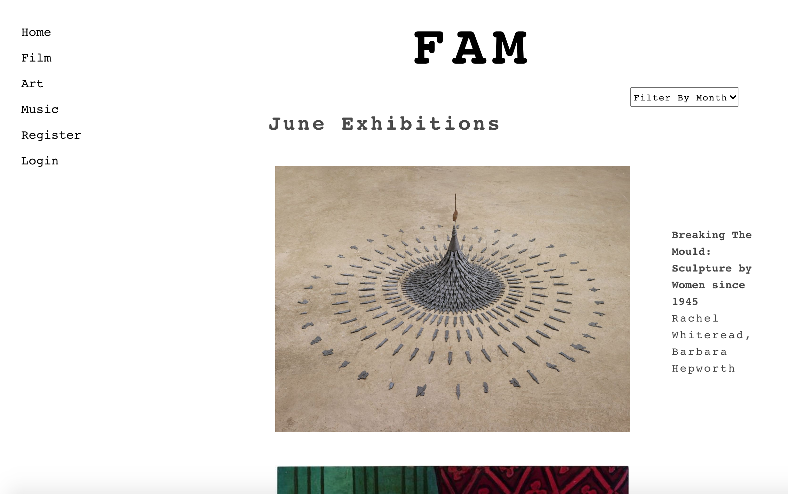

# Project 4: FAM


## Overview
Welcome to FAM.  This is a curated app. Each month we share ‘Our Favourites For The Month’ for film, art and music. 

Users can filter the posts by month in the index pages,  should they want to look at previous posts.

Signing up gives users the ability to access the favourites feature. This allows them to curate their own favourites list. 

Once signed up they are also able to leave reviews and ratings on our curated posts.

My teammate and I had 8 days to build a full stack application. We began by planning out our models’ relationships using an ERD model. We then built the foundation of our backend in Django together in pair programming.  We both wanted to work full stack on this project and so once the foundation was laid we split responsibilities. I worked full stack on the reviews and ratings. I was also responsible for building the login, register and the seeds.  The rest of the front end and styling was split 50/50. We had also explored using React Hooks in some of our components as we both really loved the concept of useState and useEffect.


## Team
I loved collaborating in a team on my previous project and so I chose to work in a pair for this project.

* [Eleanor Byass](https://github.com/ebyass)

## Deployment
The website is deployed on Heroku and can be found [here](https://the-fam.herokuapp.com/)

(After one hour of inactivity Heroku puts the dyno to sleep. The first request may be be wakening it up again and so the first request the router sends will have some delay).

## Built With
* Python
* Django
* PostgreSQL
* React
* React Hooks
* Insomnia
* Axios
* Sass
* Bulma
* Git
* GitHub

## Getting Started

To download the source code click the clone button. Run the following commands in the terminal:

### Frontend: 

* To install all the packages in the frontend directory:
```terminal
yarn 
```

* To run the app in your localhost:
* In front :
```terminal
yarn start
```

### Backend: 

To install all the packages in the root directory: 
* Install Django and a shell in the root directory: 
```terminal
pip install pipenv
```

```terminal
pipenv install django
```

```terminal
pipenv shell
```

* Create the postgreSQL database: 

```terminal
pipenv install psycopg2-binary  
```

```terminal
createdb fam  
```

* Migrate everything from the backend
```terminal
python manage.py migrate  
```

* To seed your database run the following command, in the following order:
```terminal
python manage.py loaddata jwt_users/seeds.json
```
```terminal
python manage.py loaddata genres/seeds.json
```
```terminal
python manage.py loaddata categories/seeds.json
```
```terminal
python manage.py loaddata mediums/seeds.json
```
```terminal
python manage.py loaddata posts/seeds.json
```

## Brief
**Solo or Group?**
You are free to work alone or in a group. Both ways have their pros and cons. Remember if you are working in a team that you are all on the same page and working towards the same goal.

* **Build a full-stack application** by making your own backend and your own front-end
* **Use a Python Django API** using Django REST Framework to serve your data from a Postgres database
* **Consume your API with a separate front-end** built with React
* **Be a complete product** which most likely means multiple relationships and CRUD functionality for at least a couple of models
* **Implement thoughtful user stories/wireframes** that are significant enough to help you know which features are core MVP and which you can cut
* **Have a visually impressive design** to kick your portfolio up a notch and have something to wow future clients & employers. **ALLOW** time for this.
* **Be deployed online** so it's publicly accessible.
* **React Hooks** is optional for this project

## Website Architecture

### ERD Model


We began this project by building the above ERD model. It was super beneficial for us to really understand the realtionships between our models and the attributes that each model would need to have. We would often refer back to this model whilst working through the backend.


We used insomnia to test out all of our requests. These are all the requests we built for this project.

### Wireframe


As well as the ERD model, we created a wireframe to plan out the architecture of the app. We both feel as though this is a super useful step in the planning stage. It helps to visualize the upcoming project and although we gave ourselves room for change, it was a great point of reference.
We added a list of "must have" and "nice to have". We then assigned a deadline for ourselves for when the list of "must have" had to be completed and when we wanted to be MVP ready. If we had extra time left we would look at the "nice to have" list.

I will give an overview of the app’s architecture and delve into more detail on some of the features I built.

### Home 

The home page displays the latest post. The latest post in this case is for the month of June. We chose to split the post into our three categories; film, art and music. These three categories are each represented by an image uploaded to the post model. These images will be updated the next time a post is made. When a user clicks on one of these three images they will taken to the correlating index page.

In order to always display the latest post in the home page we built the following function together:

```javascript
function Home() {

  const { data: post, error } = useFetch(getAllPosts)
  const [ recentPost, setRecentPost ] = useState('') 

  useEffect(() => {
    const max = post ? post.length - 1 : null 

    const recentPost = max ? post[max] : null

    setRecentPost(recentPost) 

  },[post]) 
  ```


To begin, what we are doing here is renaming data: with post. Now we don't need to use this.state. Everything is on post.

Knowing that post is an array, inside of the useEffect we are making the result ternary, using the variable to specify. The variable 'max' is only created with post length if post exists. (- 1 because length is not the same as the index number).

```javascript
setRecentPost(recentPost) 
```
sets post with the index that has the greatest value to the state. Now it can also be reused using recentPost.

We pass the post variable as an argument inside the dependency array. Now every time post changes, it will trigger this function to run.
Now we can access and display the most recent post. 
As seen below, the link is wrapped around each category image. Once clicked the user is taken to the appropriate index page.

```javascript
          <h2 className='info-wrapper index-page-h2'>{recentPost.info}</h2>
          <div className='home-wrapper'>
            <div className='home-item-wrapper'>
              <h3 className='home-medium-main-title-film'>{recentPost.film_title}</h3>
              <Link to={'/film'}>
                
              </Link>
            </div>
```

### Index 

- Film, Music, Art



The index pages can be accesed from the home page as mentioned above or via the navbar. Here the user can see the list of favourites for the month in their chosen cateogry. The user is also able to filter by month should they want to see previous posts. (We have the months of May and June for demo purposes).

Each image in the index is wrapped with a link 

```javascript
      <Link to={`/mediums/${medium.id}/`}>
        
      </Link>
```

### Show 


In contrast to our wireframe I found that it was only really necessary for us to have one show component. In that component I just added all the possibilities that a 'medium' can have. The show page only displays the attributes that are contained on the medium that was clicked on in the index page.

```javascript
              
            </div>
            <div className="medium-show-text">
              <div>
                <h1 className="medium-show-medium-title">{medium.title}</h1>
                {mediumToMap
                  ? mediumToMap.map((
                    mediumGenre //* like this.state. using mediumToMap from state
                  ) => (
                    <h1 className="medium-show-medium-genre" key={mediumGenre.id}>{mediumGenre.name}</h1> //* this the genre
                  ))
                  : null}

                <h1 className="medium-show-medium-creator">{medium.creator}</h1>
                <h1 className="medium-show-medium-duration">{medium.duration}</h1>
                <h1 className="medium-show-medium-date">
                  {medium.start_date} {medium.end_date}
                </h1>
                <h1 className="medium-show-medium-art-gallery-location">{medium.art_gallery_location}</h1>
                <h1 className="medium-show-medium-art-gallery">{medium.art_gallery}</h1>
                <h2 className="medium-show-medium-year">{medium.year}</h2> 
                <h1 className="medium-show-medium-price">{medium.price}</h1>
                <p className="medium-show-medium-info">{medium.info}</p>
```

### Reviews  

In reviews model serializers.py I am using the PopulatedReviewSerializer to attach the user to reviews. This way the username can later be accessed and displayed in the frontend and authentication can be applied so only the owner of the review can delete their review.

```python
class PopulatedReviewSerializer(ReviewSerializer):
    owner = UserSerializer()
```

In the medium model serializers.py;

The reviews have a many to many relationship to the medium model. I added them to the PopulatedMediumSerializer as they live on the medium. By attaching the populated review the user will now also be accessible via the medium. 

```python
from reviews.serializers import PopulatedReviewSerializer
...
class PopulatedMediumSerializer(MediumSerializer): #* Read serializer, used when you want to send populated data 
#! Singular = One to Many
#! Plural = Many to Many
    genres = GenreSerializer(many=True)
    category = CategorySerializer()
    reviews = PopulatedReviewSerializer(many=True) #* using populated review to get the user in
```


Only a user that is logged in can post reviews. They must add a rating to post a review. A red message will appear informing the user of so if they try to post a review without a rating. 
Anyone can view the reviews even if not logged in. But they can not make a post. 
Wrapped in authentication ternary in render.


### Ratings

For the ratings I used the following plug-in: 
```javascript
   "react-ratings-declarative": "^3.4.1"
```

### Register

Users can be redirected to sign in if they already have an account.

### Login

Users can be redirected to register if they don't already have an account.

### Favourites

can be seen only after a user registers and logs in.
--> brief description
---> screenshot


## Challenges
* The biggest challenges were as follows:
* Planning and building the relationships in the backend using Python and Django. 
* Working with serializers and populated serializers 
* Working in a new language we had just learnt - Python
* Working with Hooks
* Writing the logic for reviews and ratings.
* Working with a lot of nested data on our models
 
## Wins
* The greatest win for this project was how well we worked together as a team
* meeting all of our deadlines and completing all of our 'must haves'
* Working with Hooks
* Working with python
* Making the app responsive in it’s design


## Future Improvements
* More filter options and being able to filter in favourites/profile page too. Being able to filter by year, month.
* Calendar feature for the art exhibitions - so that a user can add exhibitions to their personal calendar that they can check on and get alerts.
* Have actual media, i.e film and songs for those two components. Netflix, Spotify merge.
* have update review in views.py for the review model but didn't have time to implement it in the frontend.

